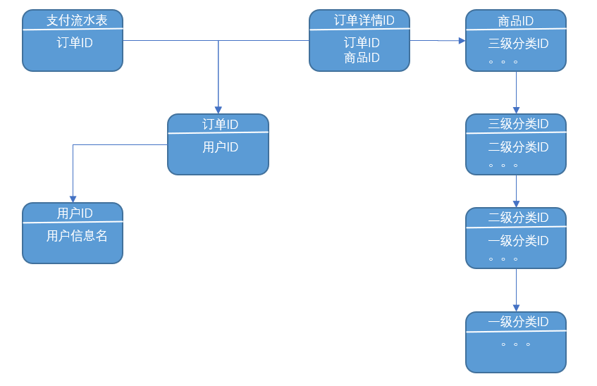
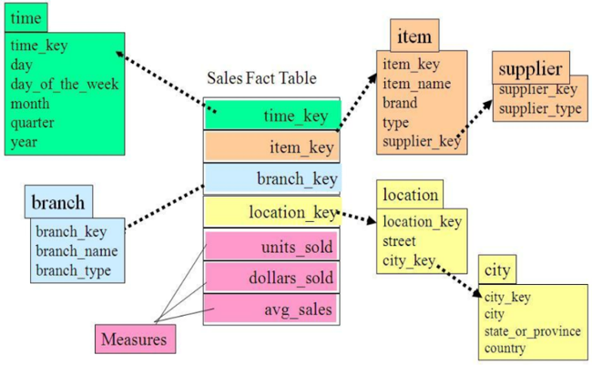
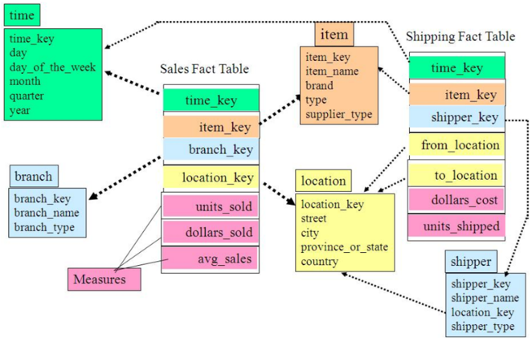

# 一、电商业务与数据结构简介
## 1.电商业务流程


## 2.电商常识(SKU、SPU)
**SKU(Stock Keeping Unit)**，库存量基本单位，现在已经被引申为产品统一编号的简称，每种产品均对应有唯一的SKU号。
**SPU(Standard Product Unit)**，是商品信息聚合的最小单位，是一组可复用、易检索的标准化信息集合。

购买一台iPhoneX手机，iPhoneX手机就是一个SPU，但是你购买的时候，不可能是以iPhoneX手机为单位买的，商家也不可能以iPhoneX为单位记录库存SKU。必须要以什么颜色什么版本的iPhoneX为单位。比如，你购买的是一台银色、128G内存的、支持联通网络的iPhoneX，商家也会以这个单位来记录库存数。那这个更细致的单位就叫库存单元(SKU)，SPU表示一类商品。好处就是：可以共用商品图片，海报、销售属性等。

## 3.电商表结构

### 3.1 订单表(order_info))

| 标签         | 含义       |
| ------------ | ---------- |
| id           | 订单编号   |
| total_amount | 订单金额   |
| order_status | 订单状态   |
| user_id      | 用户id     |
| payment_way  | 支付方式   |
| out_trade_no | 支付流水号 |
| create_time  | 创建时间   |
| operate_time | 操作时间   |

### 3.2 订单详情表(order_detail)

| 标签        | 含义     |
| ----------- | -------- |
| id          | 订单编号 |
| order_id    | 订单号   |
| user_id     | 用户id   |
| sku_id      | 商品id   |
| sku_name    | 商品名称 |
| order_price | 商品价格 |
| sku_num     | 商品数量 |
| create_time | 创建时间 |

### 3.3 商品表

| 标签         | 含义     |
| ------------ | -------- |
| id           | skuId    |
| spu_id       | spuid    |
| price        | 价格     |
| sku_name     | 商品名称 |
| sku_desc     | 商品描述 |
| weight       | 重量     |
| tm_id        | 品牌id   |
| category3_id | 品类id   |
| create_time  | 创建时间 |

### 3.4 用户表

| 标签        | 含义     |
| ----------- | -------- |
| id          | 用户id   |
| name        | 姓名     |
| birthday    | 生日     |
| gender      | 性别     |
| email       | 邮箱     |
| user_level  | 用户等级 |
| create_time | 创建时间 |

### 3.5 商品一级分类表

| 标签 | 含义 |
| ---- | ---- |
| id   | id   |
| name | 名称 |

### 3.6 商品二级分类表

| 标签         | 含义       |
| ------------ | ---------- |
| id           | id         |
| name         | 名称       |
| category1_id | 一级品类id |

### 3.7 商品三级分类表

| 标签         | 含义       |
| ------------ | ---------- |
| id           | id         |
| name         | 名称       |
| Category2_id | 二级品类id |

### 3.8 支付流水表

| 标签            | 含义               |
| --------------- | ------------------ |
| id              | 编号               |
| out_trade_no    | 对外业务编号       |
| order_id        | 订单编号           |
| user_id         | 用户编号           |
| alipay_trade_no | 支付宝交易流水编号 |
| total_amount    | 支付金额           |
| subject         | 交易内容           |
| payment_type    | 支付类型           |
| payment_time    | 支付时间           |

# 二、数仓理论(面试重点)
## 1.表的分类
### 1.1 实体表

**实体表**一般是指一个**现实存在的业务对象**，比如用户、商品、商家、销售员等等

如，用户表

| 用户id | 姓名 | 生日       | 性别 | 邮箱       | 用户等级 | 创建时间   |
| ------ | ---- | ---------- | ---- | ---------- | -------- | ---------- |
| 1      | 张三 | 2011-11-11 | 男   | zs@163.com | 2        | 2018-11-11 |
| 2      | 李四 | 2011-11-11 | 女   | ls@163.com | 3        | 2018-11-11 |
| 3      | 王五 | 2011-11-11 | 中性 | ww@163.com | 1        | 2018-11-11 |
| …      | …    | …          | …    | …          | …        | …          |

### 1.2 维度表

维度表，一般是指对应一些业务状态，编号的解释表，也可以称之为码表

比如地区表、订单状态、支付方式、审批和状态、商品分类等等

| 订单状态编号 | 订单状态名称 |
| ------------ | ------------ |
| 1            | 未支付       |
| 2            | 支付         |
| 3            | 发货中       |
| 4            | 已发货       |
| 5            | 已完成       |

| 商品分类编号 | 分类名称 |
| ------------ | -------- |
| 1            | 服装     |
| 2            | 保健     |
| 3            | 电器     |
| 4            | 图书     |

### 1.3 事务型事实表

**事务型事实表**，一般指随着业务发生不断产生的数据。特点是**一旦发生不会再变化**。
一般比如，**交易流水**，**操作日志**，**出库入库记录**等等。

| 编号   | 对外业务编号 | 订单编号 | 用户编号 | 支付宝交易流水编号 | 支付金额 | 交易内容    | 支付类型  | 支付时间            |
| ------ | ------------ | -------- | -------- | ------------------ | -------- | ----------- | --------- | ------------------- |
| 1      | 7577697945   | 1        | 111      | QEyF-63000323      | 223.00   | 海狗人参丸1 | alipay    | 2019-08-28 00:50:02 |
| 2      | 0170099522   | 2        | 222      | qdwV-25111279      | 589.00   | 海狗人参丸2 | wechatpay | 2019-08-28 00:50:02 |
| 3      | 1840931679   | 3        | 666      | hSUS-65716585      | 485.00   | 海狗人参丸3 | unionpay  | 2019-08-28 00:50:02 |
| ... | ...       | ...   | ...   | ...             | ...   | ...      | ...    | ...              |

### 1.4 周期型事实表

周期型事实表，一般指随着业务不断产生变化的数据，与事务型不同的时，数据会随着业务周期性的推进变化，比如订单，其中订单状态会周期性变化，再比如，请假、贷款申请，随着批复状态在周期性变化。

| 订单编号 | 订单金额 | 订单状态 | 用户id | 支付方式  | 支付流水号    | 创建时间            | 操作时间            |
| -------- | -------- | -------- | ------ | --------- | ------------- | ------------------- | ------------------- |
| 1        | 223.00   | 2        | 111    | alipay    | QEyF-63000323 | 2019-08-28 00:01:29 | 2019-08-28 00:01:29 |
| 2        | 589.00   | 2        | 222    | wechatpay | qdwV-25111279 | 2019-08-28 00:05:02 | 2019-08-28 00:05:02 |
| 3        | 485.00   | 1        | 666    | unionpay  | hSUS-65716585 | 2019-08-28 00:50:02 | 2019-08-28 00:50:02 |
| ...   | ...   | ...   | ... | ...    | ...        | ...              | ...              |


## 2.同步策略
数据同步策略的类型包括：全量表、增量表、新增及变化表、拉链表

> **全量表**：存储完整的数据。

> **增量表**：存储新增加的数据。

> **新增及变化表**：存储新增加的数据和变化的数据。

> **拉链表**：对新增及变化表做定期合并。

### 2.1 实体表同步策略

实体表：比如用户，商品，商家，销售员等
实体表数据量比较小：通常可以做每日全量，就是每天存一份完整数据。**即每日全量**。

### 2.2 维度表同步策略

维度表：比如订单状态，审批状态，商品分类
维度表数据量比较小：通常可以做每日全量，就是每天存一份完整数据。即每日全量。

> **说明**
> 针对可能会有变化的状态数据可以存储**每日全量**。
> 没变化的客观世界的维度（比如性别，地区，民族，政治成分，鞋子尺码）可以只**存一份固定值**。

### 2.3 事务型事实表同步策略

事务型事实表：比如，交易流水，操作日志，出库入库记录等。
因为数据不会变化，而且数据量巨大，所以每天只同步新增数据即可，所以可以做成每日增量表，即每日创建一个分区存储。

### 2.4 周期型事实表同步策略

周期型事实表：比如，订单、请假、贷款申请等
这类表从数据量的角度，存每日全量的话，数据量太大，冗余也太大。如果用每日增量的话无法反应数据变化。
 每日新增及变化量，包括了当日的新增和修改。一般来说这个表，足够计算大部分当日数据的。但是这种依然无法解决能够得到某一个历史时间点（时间切片）的切片数据。 
 所以要用利用每日新增和变化表，制作一张拉链表，以方便的取到某个时间切片的快照数据。所以我们需要得到每日新增及变化量。

**拉链表**

| name姓名 | start新名字创建时间 | end名字更改时间 |
| -------- | ------------------- | --------------- |
| 张三     | 1990/1/1            | 2018/12/31      |
| 张小三   | 2019/1/1            | 2019/4/30       |
| 张大三   | 2019/5/1            | 9999-99-99      |
| ...   | ...              | ...          |

```sql
select * from user where start =<'2019-1-2' and end>='2019-1-2';
```

## 3.范式理论

### 3.1 范式概念

关系型数据库设计时，遵照一定的规范要求，目的在于降低数据的冗余性，目前业界范式有：第一范式(1NF)、第二范式(2NF)、第三范式(3NF)、巴斯-科德范式(BCNF)、第四范式(4NF)、第五范式(5NF)。
范式可以理解为设计一张数据表的表结构，符合的标准级别。

 >使用范式的**根本目的**是：
  1）减少数据冗余，尽量让每个数据只出现一次。
  2）保证数据一致性

 **缺点**是获取数据时，需要通过Join拼接出最后的数据。


### 3.2 函数依赖

>**完全函数依赖**
设X，Y是关系R的两个属性集合，X'是X的真子集，存在X→Y，但对每一个X'都有X'!→Y，则称Y完全函数依赖于X。通过AB能得出C，但是A和B单独得不出C，那么说C完全依赖于AB。

>**部分函数依赖**
假如 Y函数依赖于 X，但同时 Y 并不完全函数依赖于 X，那么我们就称 Y 部分函数依赖于 X，通过AB能得出C，通过A也能得出C，或者通过B也能得出C，那么说C部分依赖于AB。

>**传递函数依赖**
传递函数依赖：设X，Y，Z是关系R中互不相同的属性集合，存在X→Y(Y !→X),Y→Z，则称Z传递函数依赖于X。通过A得到B，通过B得到C，但是C得不到A，那么说C传递依赖于A。

### 3.3 三范式区分
>**第一范式1NF**核心原则就是:**属性不可切割**

|  ID   |    商品     |  商家ID   | 用户ID |
| :---: | :---------: | :-------: |
|  001  | **5台电脑** | XXX旗舰店 | 00001  |

上表的5台电脑不遵守第一范式，修改后如下

|  ID   |   商品   | 数量  |  商家ID   | 用户ID |
| :---: | :------: | :---: | :-------: |
|  001  | **电脑** |   5   | XXX旗舰店 | 00001  |

实际上，1NF是所有**关系型数据库的最基本要求**，你在关系型数据库管理系统（RDBMS），例如SQL Server，Oracle，MySQL中创建数据表的时候，**如果数据表的设计不符合这个最基本的要求，那么操作一定是不能成功的**。也就是说，只要在RDBMS中已经存在的数据表，一定是符合1NF的。

>**第二范式2NF**核心原则就是:**不能存在部分函数依赖**


上表明显存在部分依赖，比如表的主键是(学号、课名)，分数确实完全依赖于(学号，课名)，但是姓名并不完全依赖于学号，改写成符合2NF的表如下

|    学号     |   课名   | 分数  |
| :---------: | :------: | :---: |
| 10222311101 | 高等数学 |  95   |
|     ...     |   ...    |  ...  |

|    学号    |  姓名  |  系名  | 系主任 |
| :--------: | :----: | :----: | :----: |
| 1022211101 | 李小明 | 经济系 | 王强   |
|    ...     |  ...   |  ...   | ...    |

>**第三范式3NF**核心原则就是:**不能存在传递函数依赖**

|    学号    |  姓名  |  系名  | 系主任 |
| :--------: | :----: | :----: | :----: |
| 1022211101 | 李小明 | 经济系 | 王强   |
|    ...     |  ...   |  ...   | ...    |

上表存在传递函数依赖:学号->系名->系主任
再次拆解为如下

|    学号    |  姓名  |  系名  |
| :--------: | :----: | :----: |
| 1022211101 | 李小明 | 经济系 |
|    ...     |  ...   |  ...   |

|  系名  | 系主任 |
| :----: | :----: |
| 经济系 |  王强  |
| 法律系 |  刘玲  |


## 4.关系建模和维度建模
>**关系模型**
关系模型主要应用与OLTP系统中，为了保证数据的一致性以及避免冗余，所以大部分业务系统的表都是遵循第三范式的。


>**维度模型**
维度模型主要应用于OLAP系统中，因为关系模型虽然冗余少，但是在大规模数据，跨表分析统计查询过程中，会造成多表关联，这会大大降低执行效率。
所以把相关各种表整理成两种：事实表和维度表两种。所有维度表围绕着事实表进行解释。


## 5.雪花模型、星型模型和星座模型
 * 在维度建模的基础上又分为三种模型：星型模型、雪花模型、星座模型。

>**雪花模型**，比较靠近3NF，但是无法完全遵守，因为遵循3NF的性能成本太高。多个维度间接关联到事实表，需要多次join。



>**星型模型**和雪花模型的区别主要在于维度的层级，标准的星型模型维度只有一层，而雪花模型可能会涉及多级。星型模型的维度表直接关联到事实表。只需要join一次。


>**星座模型**与前两种情况的区别是事实表的数量，星座模型是基于多个事实表。维度表直接关联到事实表。
基本上是很多数据仓库的常态，因为很多数据仓库都是多个事实表的。所以星座不星座只反映是否有多个事实表，他们之间是否共享一些维度表。
所以星座模型并不和前两个模型冲突。



>**模型的选择**
首先就是星座不星座这个只跟数据和需求有关系，跟设计没关系，不用选择。
星型还是雪花，取决于**性能优先**，还是**灵活更优先**。
目前实际企业开发中，不会绝对选择一种，根据情况灵活组合，甚至并存（一层维度和多层维度都保存）。但是整体来看，**更倾向于维度更少的星型模**型。尤其是Hadoop体系，减少Join就是减少Shuffle，性能差距很大。（关系型数据可以依靠强大的主键索引）


# 三、数仓搭建

## 0.配置Hadoop支持Snappy压缩

将编译后支持Snappy压缩的Hadoop jar包解压缩，并将`lib/native`目录下的所有文件上传到hadoop102的`/opt/module/hadoop-2.7.2/lib/native/`目录下，并分发到其他节点。
重启hadoop
```bash
# 检查支持的压缩方式
hadoop checknative
# hadoop:  true /opt/module/hadoop-2.7.2/lib/native/libhadoop.so
# zlib:    true /lib64/libz.so.1
# snappy:  true /opt/module/hadoop-2.7.2/lib/native/libsnappy.so.1
# lz4:     true revision:99
# bzip2:   false
```


## 1.业务数据生成

### 1.1 建表语句
创建基字符集为utf-8的数据库gmall
依次执行以下脚本
[建表脚本](../Database/sql/1建表脚本.sql)
[商品分类数据插入脚本](../Database/sql/2商品分类数据插入脚本.sql)
[函数脚本](../Database/sql/3函数脚本.sql)
[存储过程脚本](../Database/sql/4存储过程脚本.sql)

### 1.2 生成业务数据

```sql
-- 函数说明
init_data(do_date_string VARCHAR(20), order_incr_num INT,user_incr_num INT, sku_num INT, if_truncate BOOLEAN);
-- do_date_string 生成数据日期
-- order_incr_num 订单id个数
-- user_incr_num 用户id个数
-- sku_num 商品sku个数
-- if_truncate 是否删除数据

-- 案例测试
-- 生成日期2019年2月10日的数据、订单1000个、用户200个、商品sku300个、删除原始数据
CALL init_data('2019-08-28',1000,200,300,TRUE);

-- 查看结果
SELECT * from base_category1;
SELECT * from base_category2;
SELECT * from base_category3;

SELECT * from order_info;
SELECT * from order_detail;

SELECT * from sku_info;
SELECT * from user_info;

SELECT * from payment_info;
```

## 2.业务数据导入数仓
### 2.1 安装配置Sqoop
[Sqoop安装配置](link/Steps.md)

### 2.2 Sqoop导入命令
```bash
sqoop import \
--connect \
--username \
--password \
--target-dir \
--delete-target-dir \
--num-mappers \
--fields-terminated-by \
--query "$2" ' and $CONDITIONS;'
```

### 2.3 分析表


### 2.4 Sqoop定时导入脚本
[Sqoop定时导入脚本](../ShellScript/sqoop_import.sh)
```sql
-- 生成数据
CALL init_data('2019-08-27',1000,200,300,TRUE);
CALL init_data('2019-08-28',1000,200,300,TRUE);
```
```bash
# 执行数据导入脚本
sqoop_import all 2019-08-27
sqoop_import all 2019-08-28
```

### 2.5 Sqoop导入数据异常处理

 * 执行数据导入脚本时发生以下异常

```
java.hql.hqlException: Streaming result set com.mysql.jdbc.RowDataDynamic@65d6b83b is still active. No statements may be issued when any streaming result sets are open and in use on a given connection. Ensure that you have called .close() on any active streaming result sets before attempting more queries.
	at com.mysql.jdbc.hqlError.createSQLException(SQLError.java:930)
	at com.mysql.jdbc.MysqlIO.checkForOutstandingStreamingData(MysqlIO.java:2646)
	at com.mysql.jdbc.MysqlIO.sendCommand(MysqlIO.java:1861)
	at com.mysql.jdbc.MysqlIO.hqlQueryDirect(MysqlIO.java:2101)
	at com.mysql.jdbc.ConnectionImpl.execSQL(ConnectionImpl.java:2548)
	at com.mysql.jdbc.ConnectionImpl.execSQL(ConnectionImpl.java:2477)
	at com.mysql.jdbc.StatementImpl.executeQuery(StatementImpl.java:1422)
	at com.mysql.jdbc.ConnectionImpl.getMaxBytesPerChar(ConnectionImpl.java:2945)
	at com.mysql.jdbc.Field.getMaxBytesPerCharacter(Field.java:582)
```

 * 解决方案

```bash
# 加入下述导入参数
--driver com.mysql.jdbc.Driver \
```

## 3.ODS层
 * 完全仿照业务数据库中的表字段，一模一样的常见ODS层对应表

[建表语句](../Database/hql/ods_db.hql)
[ODS层数据导入脚本](../ShellScript/ods_db.sh)
```bash
# 测试导入数据
ods_db 2019-08-27
ods_db 2019-08-28
```
```sql
-- 查询验证数据
select * from ods_order_info where dt='2019-08-27' limit 1;
select * from ods_order_info where dt='2019-08-28' limit 1;
```

## 4.DWD层
 * 对ODS层进行判空过滤，对商品分类表进行维度退化(降维)

[建表语句](../Database/hql/dwd_db.hql)
[DWD层数据导入脚本](../ShellScript/dwd_db.sh)
```bash
# 测试导入数据
dwd_db 2019-08-27
dwd_db 2019-08-28
```
```sql
-- 查询验证数据
select * from dwd_sku_info where dt='2019-08-28' limit 2;
select * from dwd_sku_info where dt='2019-02-11' limit 2;
```

### 小结
>维度退化的代价
如果被退化的维度，还有其他业务表使用，退化后处理起来就麻烦些

>在实际业务员中还有哪些维度表可以退化
城市的三级分类(省、市、县)

## 5.DWS层之用户行为宽表
[建表语句](../Database/hql/dws_db.hql)
[数据导入语句](../Database/hql/dws_db.hql)
[数据导入脚本](../ShellScript/dws_db.sh)

```bash
# 测试导入数据
dws_db 2019-08-28
```
```sql
-- 查询验证数据
select * from dws_user_action where dt='2019-08-28' limit 10;
```

# 四、业务需求
## 1.GMV成交总额
<!-- TODO GMV概念 -->

[hql语句](../Database/hql/ads_gmv_sum_day.hql)
[数据导入脚本](../ShellScript/ads_db_gmv.sh)


## 2.转化率之用户新鲜度及漏斗分析
<!-- TODO 转化率概念 -->

### 2.1 ADS - 新增用户占日活跃用户比率(用户新鲜度)
[hql语句](../Database/hql/ads_user_convert_day.hql)

### 2.2 ADS - 用户行为漏斗分析
<!-- TODO 漏斗分析概念 -->
[hql语句](../Database/hql/ads_user_action_convert_day.hql)

## 3.品牌复购率
<!-- TODO 复购率计算分析 -->

### 3.1 DWS - 用户购买商品明细表(宽表)
[hql语句](../Database/hql/dws_sale.hql)
[数据导入脚本](../ShellScript/dws_sale.sh)

### 3.2 ADS - 品牌复购率
[hql语句](../Database/hql/ads_sale.hql)
[数据导入脚本](../ShellScript/ads_sale.sh)

### 3.3 每个等级的用户对应的复购率前十的商品排行
 * 每个等级，每种商品，每一次的用户数，买两次的用户数 -> 得出复购率
 * 利用开窗函数，取每个等级的前十
 * 形成脚本
[hql语句](../Database/hql/ads_rebuy_ratio_sku_top10.hql)

<!-- TODO 当前进度 -->
# 五、数据可视化

## 1.在MySQL中创建表
 * 在MySQL中创建以下表


### 1.1 每日活跃统计
[sql语句](../Database/sql/ads_uv_count.sql)

### 1.2 留存率统计
[sql语句](../Database/sql/ads_user_retention_day_rate.sql)

### 1.3 漏斗分析
[sql语句](../Database/sql/ads_user_action_convert_day.sql)

### 1.4 GMV统计
[sql语句](../Database/sql/ads_gmv_sum_day.sql)

### 1.5 全国商品销售
[sql语句](../Database/sql/ads_gmv_sum_province.sql)

## 2.Web页面查看
 * 运行spring-boot-echarts-master程序
 * 在web页面上查看显示结果
 * http://hadoop100:8080/active

## 3.Sqoop导出脚本
[Sqoop导出脚本](../ShellScript/sqoop_export.sh)
```bash
# 执行脚本
sqoop_export all
```
```sql
# MySQL中查看结果
SELECT * FROM ads_uv_count;
SELECT * FROM ads_user_retention_day_rate;
SELECT * FROM ads_user_action_convert_day;
SELECT * FROM ads_gmv_sum_day;
SELECT * FROM ads_gmv_sum_province;
```

 * 关于导出update还是insert的问题

>--update-mode：
updateonly   只更新，无法插入新数据
        allowinsert   允许新增 

>--update-key：允许更新的情况下，指定哪些字段匹配视为同一条数据，进行更新而不增加。多个字段用逗号分隔。

>--input-null-string和--input-null-non-string：
分别表示，将字符串列和非字符串列的空串和“null”转义。

[官网地址](http://sqoop.apache.org/docs/1.4.6/SqoopUserGuide.html)

>Sqoop will by default import NULL values as string null.Hive is however using string \N to denote NULL values and therefore predicates dealing with NULL(like IS NULL) will not work correctly. You should append parameters --null-string and --null-non-string in case of import job or --input-null-string and --input-null-non-string in case of an export job if you wish to properly preserve NULL values. Because sqoop is using those parameters in generated code, you need to properly escape value `\N` to `\\N`:

>Hive中的Null在底层是以“\N”来存储，
而MySQL中的Null在底层就是Null，
为了保证数据两端的一致性。
在导出数据时采用--input-null-string和--input-null-non-string两个参数。
导入数据时采用--null-string和--null-non-string。


# 六、Azkaban调度器
## 1.Azkaban安装配置
[Azkaban安装配置](link/Steps.md)

## 2.GMV指标获取的全调度流程
### 2.1 生成数据
```sql
CALL init_data('2019-02-12',300,200,300,FALSE);
```
### 2.2 编写Azkaban程序运行job
```properties
# import.job文件
type=command
do_date=${dt}
command=/home/tian/bin/sqoop_import.sh all ${do_date}
# ods.job文件
type=command
do_date=${dt}
dependencies=import
command=/home/tian/bin/ods_db.sh ${do_date}
# dwd.job文件
type=command
do_date=${dt}
dependencies=ods
command=/home/tian/bin/dwd_db.sh ${do_date}
# dws.job文件
type=command
do_date=${dt}
dependencies=dwd
command=/home/tian/bin/dws_db_wide.sh ${do_date}
# ads.job文件
type=command
do_date=${dt}
dependencies=dws
command=/home/tian/bin/ads_db_gmv.sh ${do_date}
# export.job文件
type=command
dependencies=ads
command=/home/tian/bin/sqoop_export.sh ads_gmv_sum_day 
# 将以上6个文件压缩成gmv-job.zip文件
# 创建Azkaban工程，并上传gmv-job.zip
```

### 2.3 执行任务
 * https://hadoop102:8443，并在页面上创建工程执行gmv-job.zip任务。

### 2.4 查看任务
 * 等待大约20分钟等任务执行完成后在MySQL中查看结果

```sql
select * from ads_gmv_sum_day;
```

# 七、订单表拉链表


# 八、项目总结
## 1.熟悉八张表的业务字段，每张表记住3-5个字段

## 2.数仓理论
### 2.1 表的分类
实体表
维度表
事务型事实表
周期型事实表

### 2.2 表的同步策略
实体表(全量)
维度表(全量)
事务型事实表(增量)
周期型事实表(新增和变化、拉链表)

### 2.3 范式理论
1NF:属性不可切分
2NF:不能存在部分函数依赖
3NF:不能存在传递函数依赖

### 2.4 数仓维度建模模型
星型模型:维度一层
雪花模型:维度多层
星座模型:多个事实表
性能优先选择星型模型，灵活优先选择雪花模型，企业中星型模型多一些。

## 3.Sqoop参数
sqoop import
--connect
--username
--password
--target-dir
--delete-target-dir
--num-mappers
--fields-terminated-by
--query "$2" ' and $CONDITIONS;'

### 3.1 Sqoop导入导出Null存储一致性问题
Hive中的null在底层以"\n"存储，而MySQL中Null在底层就是Null，为了保证数据两端的一致性，在导出数据时采用--input-null-string和--input-null-non-string连个存数，导入数据时采用--null-string和--null-non-string

### 3.2 Sqoop数据导出数据一致性问题

### 3.3 Sqoop底层任务的运行
只有Map阶段，没有Reduce阶段

### 3.4 Sqoop数据导出的时候一次执行多长时间
Sqoop任务5min~2h都有，取决于数量。

## 4.需求指标分析
### 4.1 GMV
一段时间内的网站成交金额(包括付款和未付款)
计算:基于用户行为宽表，对订单总金额进行sum

### 4.2 转化率
 * 先分别计算分子和分母，再相除

## 5.拉链表
 * 通过关系型数据库的create time和operation time获取数据的新增和变化
 * 用临时拉链表解决Hive中数据不能更新的问题

## 6.Azkaban
### 6.1 每天集群运行多少个job
 * 多个指标(200)*6 = 1200 (1000~2000个job)

### 6.2 每天集群运行运行多少个task
 * 1000*(5-8) = 5000 个task

### 6.3 任务挂了怎么办
 * 运行成功或者失败都会发送邮件通知

## 7.项目中表的关系整理
<!-- TODO 项目中表的关系，手绘整理 -->